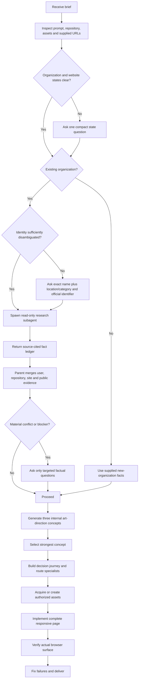

# Company intake and research flow

This document explains how `design-studio` distinguishes a new organization from an existing organization, when it asks the user for information, how existing-company research is delegated, how sources are evaluated, and how the research feeds the website build.

## Why this branch exists

A greenfield website is not necessarily a greenfield company.

An established company may be creating its first website. A brand-new company may already have an unpublished draft site. Treating company state and website state as one question can cause the agent to:

- skip necessary research for an established business;
- mistake a draft website for evidence of an operating history;
- invent brand history, customers, locations, reviews, or market presence;
- research the wrong company when multiple organizations share a name;
- copy stale or conflicting public information into the website;
- reuse public images without permission.

The workflow therefore resolves two independent axes before creative work begins.

## The two state axes

| Axis | Possible states |
|---|---|
| Organization | Brand-new organization with no established public identity / existing organization |
| Website | New web presence / existing site or page being redesigned |

This creates four practical situations:

1. Brand-new organization and new website.
2. Brand-new organization with an existing draft or prelaunch site to redesign.
3. Existing organization creating a new website.
4. Existing organization redesigning an existing website.

A new website for an existing company always uses the existing-company research branch, even when no previous website exists.

## When the agent asks the user

The agent first inspects the user prompt, repository, assets, existing copy, configuration, and any supplied URLs. It does not ask for information already available from those sources.

When company state or website state remains unresolved, the agent asks one compact intake question:

```text
Which situation is this?

1. Brand-new organization and new website.
2. Brand-new organization with an existing draft/prelaunch site to redesign.
3. Existing organization creating a new website.
4. Existing organization redesigning an existing website.
```

The workflow does not expand this into a general branding interview.

## Information required for an existing organization

Before public research begins, the agent needs the exact public or trading name plus enough information to distinguish the organization from namesakes.

Required:

- exact public or trading name;
- country, city, market, or business category.

At least one official identifier is strongly preferred:

- official website;
- Google Business Profile or Google Maps URL;
- verified address;
- verified phone number;
- verified social profile;
- another official registry, profile, or listing URL.

If the identity remains ambiguous, the agent asks for clarification before research. It does not select the most likely search result and silently continue.

For example:

```text
Several businesses use this name. Which one should the website represent?
Please provide its city/country and, if possible, its Google Maps URL or official website.
```

## Brand-new organization branch

A brand-new organization has no operating history to research.

The agent builds from:

- user-supplied offering and audience;
- approved company or product name;
- repository assets;
- desired primary action;
- factual operating plans;
- required brand constraints;
- approved positioning.

The agent may create new positioning, names, visual direction, and communication concepts, but it must present them as new work. It must not imply:

- existing customers;
- years in operation;
- public reputation;
- reviews or ratings;
- awards;
- established locations;
- historical results;
- market adoption;
- certifications or partnerships.

Missing business facts narrow the website content. They do not authorize fictional history or proof.

## Existing-organization research branch

For an existing organization, `design-studio` runs company research before art direction.

When the runtime supports subagents, the parent agent spawns one read-only research subagent. The parent remains the integration owner and may inspect the repository and existing website concurrently.

When subagents are unavailable, the parent performs the same research inline. It must not silently skip the branch.

The research subagent receives:

- exact organization name;
- location, market, or category;
- official identifiers supplied by the user;
- relevant user-provided facts;
- known conflicts or constraints;
- requested website scope.

The subagent researches and reports. It does not edit the website, define the final art direction, contact the company, authenticate into private accounts, or publish assets.

## Required research output

The research result uses this compact contract:

```text
Identity match and disambiguation:
Official sources:
Fact ledger (fact / exact source URL / accessed date / confidence / volatility):
Offering, audiences, locations, hours, contact and real conversion routes:
Brand language, visual cues and recurring source material:
Evidence inventory with source-faithful labels:
Public reputation themes (not republishable testimonials by default):
Potential assets (URL / owner or license / reuse status):
Conflicts, stale claims and unknowns:
Facts unsafe to publish:
Questions whose answers would materially change the site:
```

This result stays in working context. The workflow creates a separate research report only when the user requests one or the repository already uses that convention.

## Research source hierarchy

The practical source order is:

1. Current user-provided facts and corrections.
2. Repository assets, content, configuration, and data.
3. Current official company sources.
4. The existing rendered website.
5. Verified business listings and official social profiles.
6. Official filings, catalogs, menus, documentation, or press material.
7. Reputable independent coverage.
8. Reviews as research signals only.
9. Researcher inference, which is never publishable as fact.

User-provided current facts and corrections take precedence. Public sources may reveal a conflict, but they do not silently override the user.

## Source rules

### Search results are discovery tools

Search engines, knowledge panels, snippets, cached extracts, and aggregator summaries help locate sources. They are not final evidence.

The researcher opens the underlying source and records its exact URL and access date. A search-result statement without an inspectable source remains unverified.

### Identity must be verified

The researcher confirms that sources refer to the exact organization by comparing available identifiers such as:

- official domain;
- business name spelling;
- address;
- phone number;
- location;
- category;
- verified social links;
- linked booking or commerce destination.

Sources from a namesake must not enter the source ledger.

### Volatile facts need current evidence

The following can change quickly:

- opening hours;
- prices;
- staff and leadership;
- promotions;
- availability;
- menus;
- booking destinations;
- phone numbers;
- ratings and review counts;
- policies;
- product specifications;
- locations.

The ledger records access dates and volatility. Stale sources are identified rather than blended into current claims.

### Facts, claims, inference, and conflicts stay separate

Every useful finding is classified as one of:

- sourced fact;
- claim made by an official or public source;
- researcher inference;
- unresolved conflict;
- unknown.

Researcher inference may inspire a question, metaphor, or exploratory direction. It cannot become published company identity, proof, or factual copy.

## Fact ledger

A useful ledger entry contains:

| Field | Meaning |
|---|---|
| Fact or claim | Exact information found without promotional strengthening |
| Source URL | Inspectable underlying source, not a search-results page |
| Accessed date | When the source was checked |
| Confidence | High, medium, or low based on identity and source quality |
| Volatility | Stable, periodically changing, or highly volatile |
| Publishability | Safe, needs confirmation, contextual only, or unsafe |

Example:

```text
Fact: Reservations are handled through <verified destination>.
Source: https://example.com/reservations
Accessed: 2026-08-25
Confidence: High — linked from the official website.
Volatility: Periodically changing.
Publishability: Safe after confirming this remains the intended primary conversion.
```

The ledger preserves the source's abstraction level. For example, `material test data` does not become certification, field testing, or demonstrated product performance unless the source establishes that narrower fact.

## Review and reputation handling

Reviews can help the agent understand:

- recurring visitor questions;
- common praise or complaints;
- practical objections;
- reputation themes;
- customer vocabulary;
- information that the website should clarify.

Reviews are not automatically reusable testimonials.

The website must not republish:

- exact review text;
- reviewer identity;
- rating;
- aggregate rating;
- review count;
- platform branding;

unless there is an exact current source and a confirmed permission or platform-policy basis for that use.

A review theme may influence information architecture without becoming a quotation. For example, repeated public questions about parking may justify asking the company for verified parking information. They do not authorize the agent to claim that parking is available.

## Asset and image handling

Public visibility does not grant reuse rights.

The researcher may identify candidate:

- logos;
- venue or product photography;
- video;
- team photography;
- press images;
- social content;
- diagrams;
- menus or promotional artwork.

Each candidate is recorded as:

```text
URL / apparent owner / license or permission / reuse status
```

Until reuse is authorized, the asset is a reference only. The agent must not automatically:

- download it;
- crop it;
- remove a watermark;
- edit it;
- republish it;
- use a search thumbnail;
- assume an official social post is a website asset.

`design-asset-sources` may use researched assets only after ownership, license, attribution, and reuse permission are established.

## Privacy and ethical limits

The research branch does not:

- collect private personal data;
- bypass authentication;
- scrape against a source's terms;
- infer protected or sensitive traits;
- research an individual's unrelated personal history;
- convert gossip into brand material;
- contact customers, employees, or the company;
- make purchases or bookings;
- claim access to unavailable private systems.

Only relevant, attributable information about the exact organization belongs in the research result.

## Parent-agent integration

The parent agent merges four evidence streams:

1. User-provided information.
2. Repository evidence.
3. Existing-site observations, when a site exists.
4. Public-company research.

This becomes one source ledger used by:

- `art-direction-engine` for factual brand truth;
- `site-structure-orchestrator` for visitor questions and page architecture;
- `site-proof` for supported evidence only;
- `site-pricing` for verified prices and terms only;
- `site-faq` for factual answers only;
- `site-conversion` for real contact or booking routes;
- `design-asset-sources` for authorized asset candidates;
- `seo-foundation` for organization identity and truthful structured data.

The parent—not the research subagent—chooses the concept, page structure, specialist routing, assets, copy, implementation, and verification plan.

## Follow-up questions after research

The agent asks the user only when an unresolved issue would:

- identify the wrong organization;
- make the page materially false;
- break the primary action;
- change the central positioning or concept;
- require unsupported legal, medical, scientific, or safety claims;
- determine whether an important asset may be reused;
- require credentials, paid generation, or a destructive launch decision.

Examples:

```text
The official sources show two locations under this name. Which location should this website represent?
```

```text
The official site uses one booking service, while the supplied Google profile links to WhatsApp. Which should be the primary booking action?
```

```text
Public venue photographs exist, but their reuse rights are unclear. Please provide owned originals or authorize another asset route.
```

Optional unknowns do not block the build. The agent omits the unsupported section, uses narrower copy, or chooses a factual alternative.

## Complete workflow



## Current end-to-end flow

### Stage 1: Intake

1. Read prompt and repository.
2. Resolve organization state and website state.
3. Ask one compact state question only when unresolved.
4. Disambiguate an existing organization's identity.

### Stage 2: Research

1. Spawn one read-only research subagent for an existing organization.
2. Gather current official and attributable information.
3. Build the fact ledger.
4. Record conflicts, volatility, uncertainty, and reuse rights.

### Stage 3: Integration

1. Merge user, repository, current-site, and research evidence.
2. Give user corrections precedence.
3. Ask only material follow-up questions.
4. Omit or narrow unsupported content.

### Stage 4: Direction and structure

1. `art-direction-engine` generates three internal concepts.
2. Unsupported factual nouns cause concept rejection.
3. The strongest concept becomes the visual-world contract.
4. `site-structure-orchestrator` creates the visitor decision journey.
5. Only necessary structural specialists are loaded.

### Stage 5: Assets and implementation

1. Prefer user and repository assets.
2. Use researched public assets only after reuse rights are established.
3. Keep factual content and controls in HTML.
4. Build responsive, mobile-specific compositions.
5. Preserve existing behavior during redesigns.

### Stage 6: Verification and delivery

1. Serve the real build over HTTP.
2. Exercise desktop, laptop, tablet, and mobile.
3. Verify target browsers, keyboard, zoom, reflow, forced colors, reduced motion, performance, forms, failures, and primary conversion.
4. Fix observed failures.
5. Deploy only when explicitly requested.

## Limitations

### Public research can be incomplete

Some businesses have sparse, stale, conflicting, or duplicated public profiles. Research cannot make unknown facts reliable. The result must expose uncertainty rather than fill gaps.

### Google information is not automatically authoritative

Google Business and Maps data can be user-edited, stale, duplicated, or incorrectly associated. It is useful evidence, especially when verified by the business, but conflicts still require resolution.

### Research cannot prove asset rights

Finding an image, logo, review, or video does not establish permission to reuse it. Owned originals, explicit licenses, platform permissions, or user authorization remain necessary.

### Research is not legal due diligence

The workflow does not establish legal ownership, trademark clearance, regulatory compliance, privacy compliance, accessibility certification, or permission to republish third-party content.

### Reputation research is not customer research

Public reviews reveal themes but do not replace interviews, analytics, usability testing, conversion research, or representative customer research.

### Source confidence changes over time

Hours, prices, policies, staff, ratings, products, and availability may change after research. Volatile facts need confirmation before launch and ongoing ownership after delivery.

### Subagent availability varies

When the runtime lacks subagents, the parent performs the same research inline. This preserves the factual contract but loses background concurrency and independent context isolation.

### The branch does not eliminate user decisions

The agent can infer creative and structural choices. It cannot safely decide between conflicting locations, booking routes, legal claims, reuse permissions, or business policies without authoritative input.

## Example: existing karaoke business

User input:

```text
Build a website for an existing karaoke venue named Example Karaoke in São Paulo.
Google Maps: https://maps.google.com/...
Primary goal: room reservations.
```

Expected behavior:

1. Organization state is existing; website state is inferred or asked only if it affects redesign preservation.
2. The Google Maps URL disambiguates the business.
3. A read-only subagent researches official sources, listing data, contact routes, public reputation themes, practical visitor questions, and possible assets.
4. The parent compares the research with user facts and repository content.
5. Conflicting reservation destinations or opening hours cause a targeted question.
6. Reviews may reveal questions about room size, song selection, parking, or food, but those details remain unknown until verified.
7. Public photos remain references until reuse permission is established.
8. The verified source ledger informs art direction, structure, copy, SEO, and the real reservation CTA.

## Example: brand-new karaoke business

User input:

```text
Build a website for a new karaoke bar that has not opened yet.
The working name is Electric Chorus.
Primary goal: collect opening notifications.
```

Expected behavior:

1. The organization is classified as brand new.
2. The agent does not search for operating history, reviews, opening hours, or venue reputation.
3. It uses supplied plans and approved positioning.
4. It does not imply an existing venue, customers, room inventory, menu, or opening date.
5. The conversion route is a real waitlist endpoint if supplied; otherwise the agent asks for the mechanism or uses a truthful non-form alternative.
6. New visual identity and copy are presented as new creative work.

## Skills participating in this branch

- `design-studio`: owns state intake, research routing, source-ledger integration, questions, implementation, and verification.
- `agency-site-setup`: thin entry point that invokes the same state and research gate.
- `art-direction-engine`: accepts only sourced factual brand truth for existing organizations.
- `design-asset-sources`: treats researched public assets as candidates until reuse rights are established.
- `seo-foundation`: accepts only verified organization facts and authorized assets for metadata and structured data.

The company-research branch deepens the existing one-shot workflow without turning it into mandatory approval theater: one state question when necessary, one focused research branch for existing organizations, targeted clarification only for material conflicts, then complete design, implementation, verification, and delivery.
